# AsyncHired - README

## Overview

AsyncHired is a cutting-edge job search application specifically tailored for the tech industry. Developed by a team of skilled professionals, this app stands out by aggregating job listings from various websites, presenting them in a user-friendly interface.

### Creators

- Nacho Planas
- Christopher Heinzmann
- Niels Koop
- Patrik Róbert Horváth

## Tech Stack

The application is built using the T3 stack, ensuring a robust and scalable solution. The key technologies include:

1. **Next.js**: A React framework that enables server-side rendering and generates static websites, enhancing performance and SEO.
2. **React**: A JavaScript library for building user interfaces, ensuring a dynamic and responsive design.
3. **TypeScript**: A superset of JavaScript that adds static types, improving maintainability and developer productivity.
4. **Tailwind CSS with HeadlessUI**: A utility-first CSS framework paired with a set of completely unstyled, fully accessible UI components.
5. **Tanstack Query**: A powerful data synchronization library for React.
6. **tRPC**: A framework for building typesafe APIs, utilizing Zod for input validation, simplifying the API layer.
7. **Prisma**: An open-source database toolkit, making database access easy and type-safe.
8. **Clerk**: A platform for secure and easy user authentication and management.
9. **AWS RDS**: Amazon's relational database service, ensuring scalable and reliable database storage.
10. **Puppeteer**: A Node library for controlling headless Chrome, used for efficient web scraping.
11. **Cypress**: An end-to-end testing framework, ensuring the reliability of the application.

## Features

AsyncHired offers a range of features designed to streamline the tech job search process:

- **Advanced Filtering**: Users can refine job searches by various criteria such as role, description, date posted, company, salary, and location.
- **Personalization**: The application allows users to save searches, like or dislike job listings, and apply to jobs directly. Users can also customize their profiles to enhance job recommendations and alerts.
- **Job Data Aggregation**: By using Puppeteer for web scraping, the app collates job listings from multiple websites, providing a comprehensive view of the job market.

## Getting Started

### Installation
 **Clone the repository**
   ```bash

   git clone __click the Code button and copy your preferred cloning option__
   cd asynchired

### Install dependencies
   npm install

### Start the development server
   npm run dev
   ```
Visit http://localhost:3000 in your browser to view the app.

## Demo Screenshots

Homepage

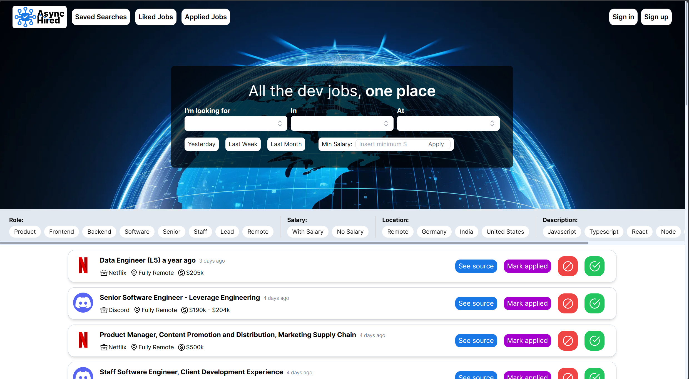

Login

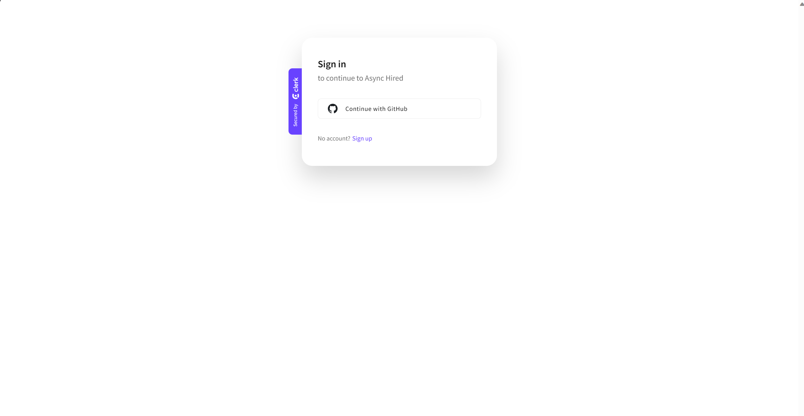

Scroll through jobs with infinite scrolling, like, dislike, apply, and press the bottom right arrow to return to the filters

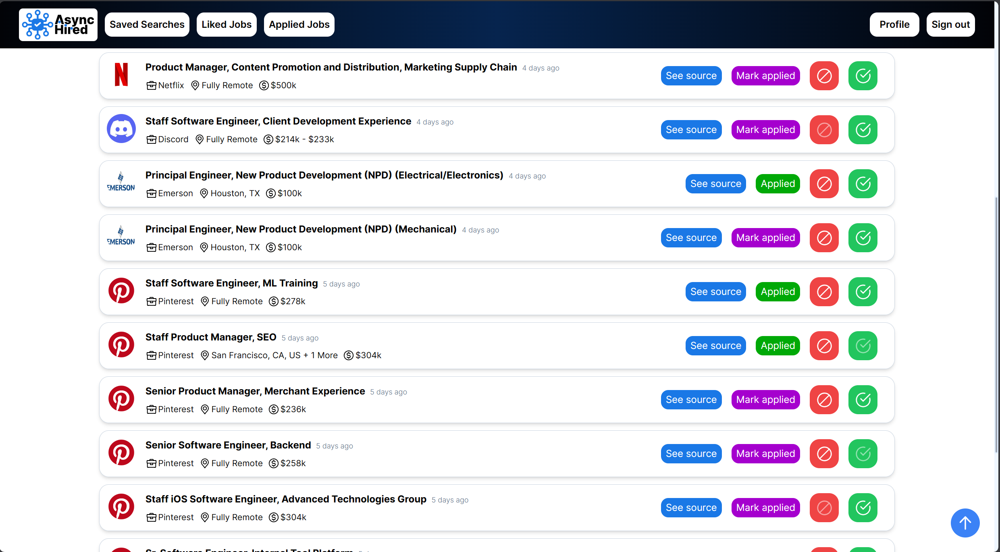

Filter jobs with input fields, buttons and tags to find exactly what you're looking for

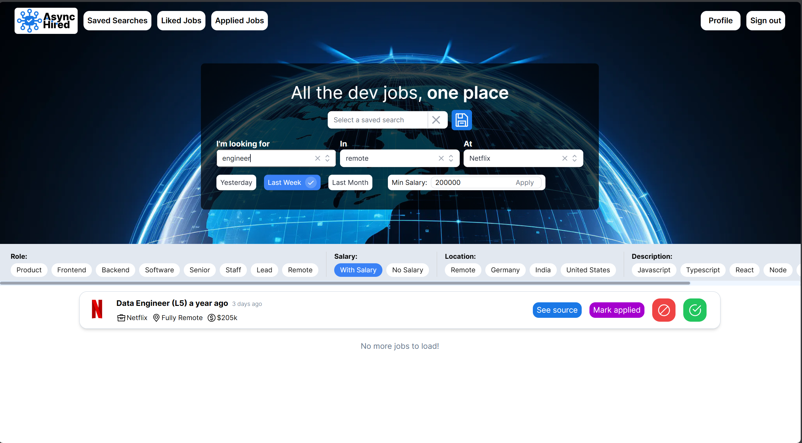

Save your search for later!

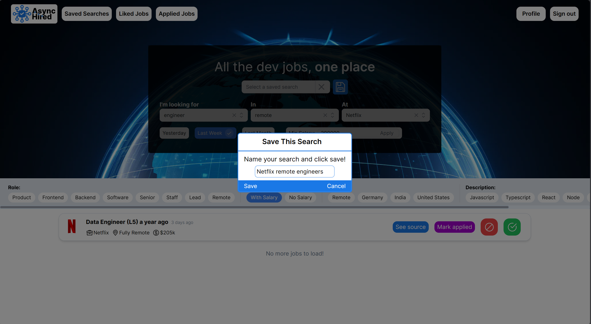

Click the select menu to find your saved searches

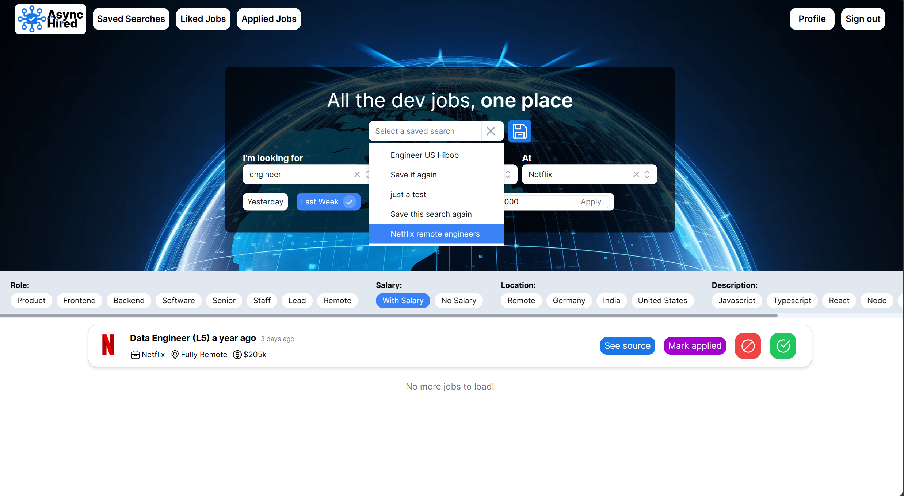

Click on the job listing to see the job description and more

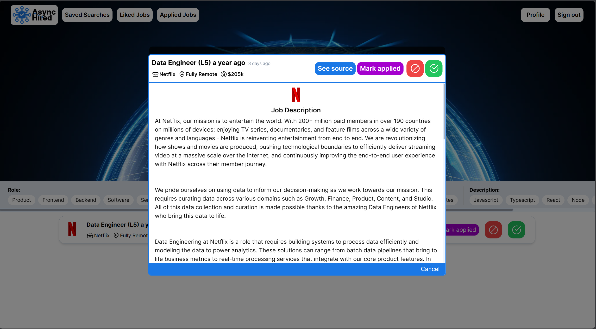

Take it on the go thanks to a fully responsive interface

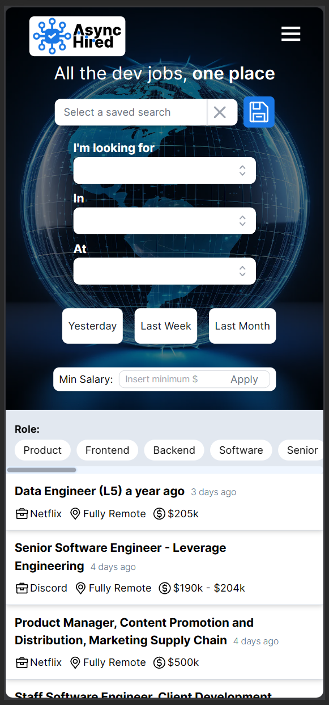

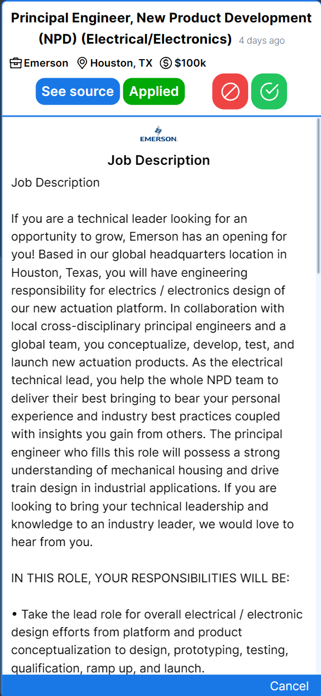

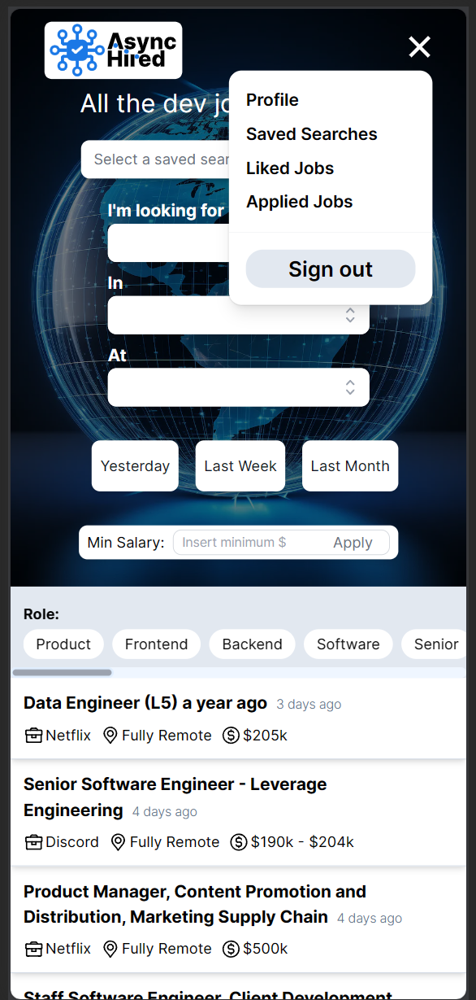

Navigate to the profile page or straight to where you want to be with the nav bar.
Go through your liked, disliked, and applied jobs, or update your profile

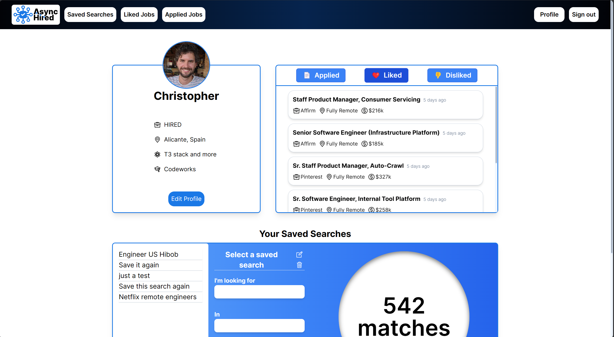

Review, update, or delete your saved searches and the predicted matches

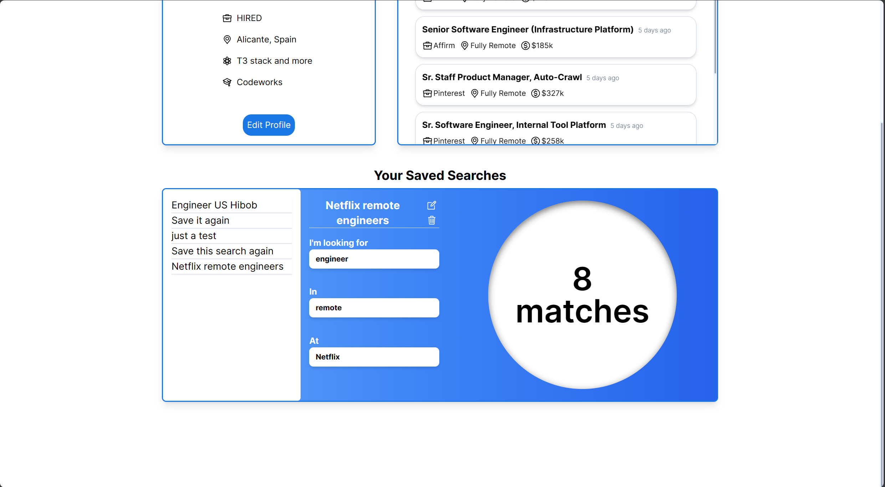

Editing a search updates the predicted matches

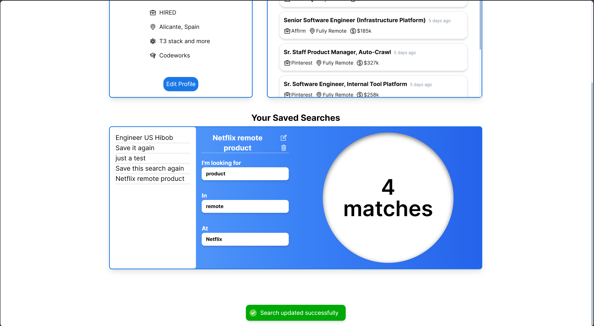

Once again, take it on the go!

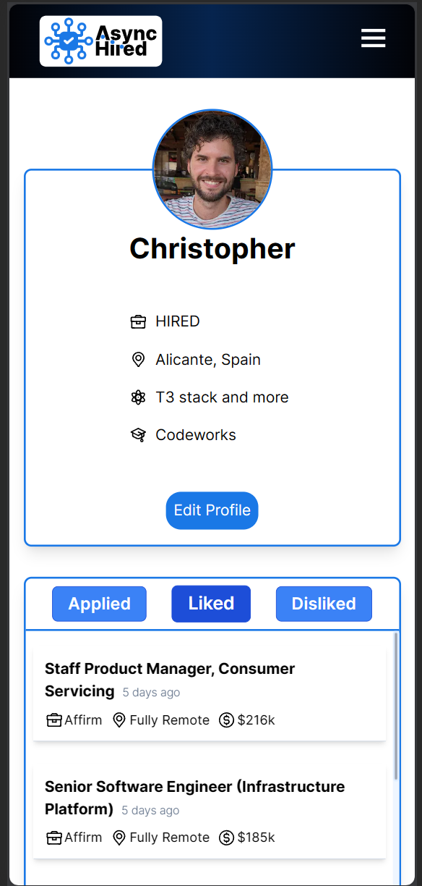

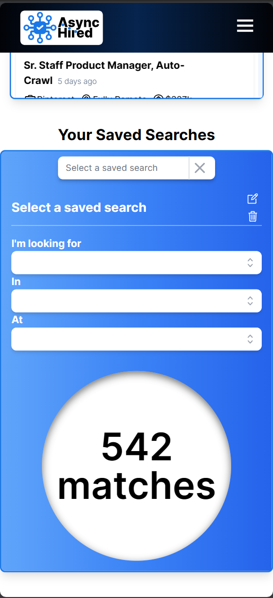

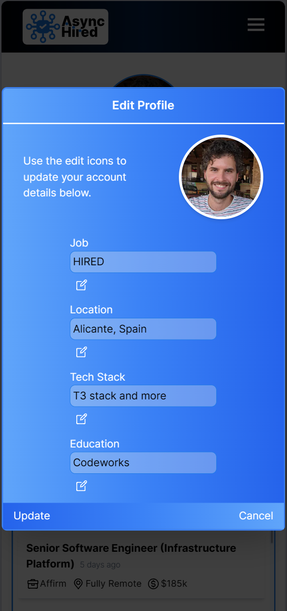